# Brainstorming Ideas Into Designs

Help turn ideas into fully formed designs and specs through natural collaborative dialogue.

Start by understanding the current project context, then ask questions one at a time to refine the idea. Once you understand what you're building, present the design and get user approval.

<HARD-GATE>
Do NOT invoke any implementation skill, write any code, scaffold any project, or take any implementation action until you have presented a design and the user has approved it. This applies to EVERY project regardless of perceived simplicity.
</HARD-GATE>

## Anti-Pattern: "This Is Too Simple To Need A Design"

Every project goes through this process. A todo list, a single-function utility, a config change — all of them. "Simple" projects are where unexamined assumptions cause the most wasted work. The design can be short (a few sentences for truly simple projects), but you MUST present it and get approval.

## quick_edit Preflight Exception

`quick_edit` is a **conservative preflight exception** owned by `brainstorming`, not the default path for small work.

- Use it only when the request is bounded single-repo work whose intent, acceptance, touched surface, and verification path are already clear enough that separate plan authoring would add little coordination value.
- It is not restricted to strictly one-shot edits; small multi-step work may still qualify when ambiguity and coordination overhead stay low.
- If the request is even slightly ambiguous, **ambiguous cases stay on the normal brainstorming → spec path**.
- This exception is about how `brainstorming` classifies the request before plan authoring; it does not turn all small requests into automatic implementation work.

### Allowed examples

- small bugfix
- copy / text edit
- config / flag / path tweak
- other bounded same-repo changes where verification is already clear

### Disallowed examples

- broad behavior changes
- shared contract / policy wording with meaningful downstream coordination
- cross-skill changes
- cross-repo changes
- rollout / migration choreography
- anything that still needs design clarification before implementation

### Beads handling for quick_edit

In a Beads-enabled repo, when `brainstorming` explicitly chooses the quick_edit path:

- create a **new standalone execution issue** for that `quick_edit` work
- **label that new issue `quick_edit`**
- do **not** treat the parent bead as the `quick_edit` issue
- this **does not change the normal spec-path parent** / `spec_id` / `reviewed:spec` rules used by regular brainstorming → spec runs

## skill_eval_fast_path Preflight Exception

`skill_eval_fast_path` is a conservative spec-to-execution lane for skill artifact work where a full implementation plan would add ceremony but not reduce risk.

Use it only after the written spec has passed the normal spec-review and user-review gates, and only when the approved work is primarily about a skill artifact such as `SKILL.md`, `references/`, `evals/`, trigger descriptions, or bundled skill resources.

Allowed examples:

- creating or revising a Codex/Claude skill artifact
- improving skill trigger descriptions
- adding or updating skill eval prompts, assertions, or bundled references
- small helper/resource changes whose acceptance is captured by skill evals or contract tests

Disallowed examples:

- Beads lifecycle, PR merge, or repo automation behavior where execution order can affect durable state
- broad cross-skill orchestration or rollout/migration choreography
- changes whose touched surface, acceptance criteria, or verification path remain unclear after spec-review
- work that still needs a step-by-step implementation plan to coordinate multiple subsystems

When this lane is selected:

- `writing-plans` is not required, and `plan-review` may be skipped because there is no plan artifact to review.
- Record `skill_eval_fast_path` as the selected execution lane instead of invoking `writing-plans` or `skill-creator`.
- Do not invoke `skill-creator` from brainstorming unless the user explicitly asks to continue execution in the same session.
- The later execution workflow owns running `skill-creator`.
- Require eval-first skill development: write or update eval cases before finalizing the skill change.
- Require at least one positive trigger eval, one negative trigger eval, and one behavior/execution eval unless the user explicitly narrows the scope or a real blocker is documented.
- Prefer `with_skill` vs `without_skill` comparison when the skill output can be evaluated meaningfully.
- Treat eval-first RED → GREEN → REFACTOR as the skill equivalent of TDD.
- `skill_eval_fast_path` never skips implementation-review, verification evidence, or follow-up capture.

### Beads handling for skill_eval_fast_path

In a Beads-enabled repo, when `brainstorming` explicitly chooses `skill_eval_fast_path`:

- reuse the parent bead linked to the reviewed spec when the skill work is the approved parent scope
- record the selected execution lane in human-readable output or metadata when the caller supports metadata
- prefer parent metadata such as `execution_lane=skill_eval_fast_path`, `skill_eval_fast_path=yes`, and `skill_eval_fast_path_source=spec`
- do not add `reviewed:plan` unless a real plan exists and passed `plan-review`
- do not create child execution beads from brainstorming
- keep `reviewed:spec` owned by the normal brainstorming spec gate

## Checklist

You MUST create a task for each of these items and complete them in order:

1. **Explore project context** — check files, docs, recent commits
2. **Offer visual companion** (if topic will involve visual questions) — this is its own message, not combined with a clarifying question. See the Visual Companion section below.
3. **Ask clarifying questions** — one at a time, understand purpose/constraints/success criteria
4. **Propose 2-3 approaches** — with trade-offs and your recommendation
5. **Optional Codex collaboration (Claude Code only)** — if Claude Code has `codex-plugin-cc` available and a second design pass would materially help, delegate exactly one bounded advisory design-analysis task to Codex. Treat Codex output as advisory only.
6. **Present design** — in sections scaled to their complexity, get user approval after each section
7. **Write design doc** — save to `docs/superpowers/specs/YYYY-MM-DD-<topic>-design.md` and commit
8. **Spec self-review** — quick inline check for placeholders, contradictions, ambiguity, scope (see below)
9. **Formal independent spec-review gate** — after self-review and before user review, run a formal `spec-review` through an independent reviewer. This initial gate is mandatory for written specs. Harness-specific executor:
   - **Codex:** dispatch a bounded read-only subagent via `spawn_agent` and instruct it to invoke the `spec-review` skill on the current spec path.
   - **Claude Code:** use `/codex:rescue` and instruct Codex to invoke the `spec-review` skill on the current spec path and return the formal review block.
   Reading `spec-review` references, doing a checklist pass, or saying "spec-review 기준으로 점검" does **not** satisfy this step. This initial gate is complete only after the transcript contains the formal `## Spec Review` output with `Verdict:` from the harness's independent-review executor, and the main agent has summarized what changed. When the formal review was produced by a sidecar or subagent, the main agent must surface that latest formal review block into the main transcript before or alongside the reconciliation summary.
10. **Automatic independent spec-review loop** — after each **substantive** spec edit and before the User Review Gate, re-run the harness's independent-review executor until the review reaches a non-blocking verdict (`APPROVE` or `APPROVE_WITH_CHANGES`), the pass cap is reached, or the same material findings repeat without substantive progress. The reviewer remains advisory only; the main agent applies revisions and owns final judgment. Cap this automatic independent loop at 3 passes. If that cap is reached while blockers remain, do **not** ask the user immediately; instead run a post-cap main-agent direct `spec-review` / reconciliation loop up to 3 passes before escalating.
    Hard gate:
    - In Codex, if `spawn_agent` is available, the spec-review subagent path is mandatory.
    - In Claude Code, if `/codex:rescue` is available, the Codex sidecar spec-review path is mandatory.
    - If the harness executor is available, start it automatically and narrate progress instead of asking permission.
    - Do NOT turn this mandatory step into a numbered choice, `request_user_input` choice, or approval question.
    - Do NOT silently skip the initial independent-review executor in favor of a main-agent direct review.
    - Do NOT claim the executor is policy-blocked or unavailable unless the tool is actually unavailable in the current harness.
    - Do NOT ask the user whether to run the post-cap direct reconciliation loop; narrate progress and continue automatically.
    - If the independent-review executor is unavailable or policy-blocked, say so explicitly. A direct `spec-review` fallback may still help reconcile the spec, but it does **not** replace the initial independent-review requirement when that requirement has not yet been satisfied in the current run.
    - Do NOT mark `reviewed:spec`.
    - Do NOT invoke `writing-plans`.
    - Do NOT say the spec gate is complete.
    - Do NOT proceed if the transcript lacks at least one completed formal `spec-review` result from the harness's independent-review executor and the main agent's reconciliation summary for that independent pass, unless the executor is actually unavailable or policy-blocked.
    - Do NOT escalate to the user while remaining blockers are still likely addressable by the post-cap direct reconciliation loop.
    until the latest pass has finished and its findings have been reconciled by the main agent.
11. **Optional Codex challenge re-review loop (Claude Code only)** — if a written spec exists and Claude Code has `codex-plugin-cc` available, default to one bounded advisory Codex critique pass after the formal independent review work is already resolved. If substantive spec edits are made and material findings remain, you may re-run it up to 3 total advisory passes per brainstorming run.
12. **User reviews written spec** — ask user to review the spec file before proceeding
13. **Mark parent bead `reviewed:spec`** — after the full spec gate passes, the main brainstorming flow labels the linked parent bead
14. **Record execution lane and stop** — default to `plan`. If `skill_eval_fast_path` applies, record that lane on the parent bead or final handoff summary. Do not invoke `writing-plans` or `skill-creator` automatically. End after the reviewed spec is linked, labeled, committed, and pushed.

## Process Flow

```dot
digraph brainstorming {
    "Explore project context" [shape=box];
    "Visual questions ahead?" [shape=diamond];
    "Offer Visual Companion\n(own message, no other content)" [shape=box];
    "Ask clarifying questions" [shape=box];
    "Propose 2-3 approaches" [shape=box];
    "Need bounded Codex design pass?" [shape=diamond];
    "Run optional Codex collaboration" [shape=box];
    "Present design sections" [shape=box];
    "User approves design?" [shape=diamond];
    "Write design doc" [shape=box];
    "Spec self-review\n(fix inline)" [shape=box];
    "Run formal\nspec-review" [shape=box];
    "Apply spec-review\nfixes" [shape=box];
    "Need another automatic\nspec-review pass?" [shape=diamond];
    "Need post-cap direct\nreconciliation?" [shape=diamond];
    "Run direct spec-review\nand reconcile" [shape=box];
    "Direct passes < 3 and\nblockers remain?" [shape=diamond];
    "Ask user about\nremaining blockers" [shape=box];
    "Need optional Claude Code\nchallenge pass?" [shape=diamond];
    "Run optional Codex\nchallenge pass" [shape=box];
    "Claude Code advisory passes\n< 3 and substantive changes remain?" [shape=diamond];
    "User reviews spec?" [shape=diamond];
    "Mark parent bead\nreviewed:spec" [shape=box];
    "Record execution lane" [shape=box];
    "Stop after spec handoff" [shape=doublecircle];

    "Explore project context" -> "Visual questions ahead?";
    "Visual questions ahead?" -> "Offer Visual Companion\n(own message, no other content)" [label="yes"];
    "Visual questions ahead?" -> "Ask clarifying questions" [label="no"];
    "Offer Visual Companion\n(own message, no other content)" -> "Ask clarifying questions";
    "Ask clarifying questions" -> "Propose 2-3 approaches";
    "Propose 2-3 approaches" -> "Need bounded Codex design pass?";
    "Need bounded Codex design pass?" -> "Run optional Codex collaboration" [label="yes"];
    "Need bounded Codex design pass?" -> "Present design sections" [label="no"];
    "Run optional Codex collaboration" -> "Present design sections";
    "Present design sections" -> "User approves design?";
    "User approves design?" -> "Present design sections" [label="no, revise"];
    "User approves design?" -> "Write design doc" [label="yes"];
    "Write design doc" -> "Spec self-review\n(fix inline)";
    "Spec self-review\n(fix inline)" -> "Run formal\nspec-review";
    "Run formal\nspec-review" -> "Apply spec-review\nfixes";
    "Apply spec-review\nfixes" -> "Need another automatic\nspec-review pass?";
    "Need another automatic\nspec-review pass?" -> "Run formal\nspec-review" [label="yes"];
    "Need another automatic\nspec-review pass?" -> "Need post-cap direct\nreconciliation?" [label="cap reached"];
    "Need another automatic\nspec-review pass?" -> "Need optional Claude Code\nchallenge pass?" [label="non-blocking"];
    "Need post-cap direct\nreconciliation?" -> "Run direct spec-review\nand reconcile" [label="yes"];
    "Need post-cap direct\nreconciliation?" -> "Need optional Claude Code\nchallenge pass?" [label="no"];
    "Run direct spec-review\nand reconcile" -> "Direct passes < 3 and\nblockers remain?";
    "Direct passes < 3 and\nblockers remain?" -> "Run direct spec-review\nand reconcile" [label="yes"];
    "Direct passes < 3 and\nblockers remain?" -> "Ask user about\nremaining blockers" [label="still blocked"];
    "Direct passes < 3 and\nblockers remain?" -> "Need optional Claude Code\nchallenge pass?" [label="resolved"];
    "Ask user about\nremaining blockers" -> "Write design doc" [label="revise"];
    "Need optional Claude Code\nchallenge pass?" -> "Run optional Codex\nchallenge pass" [label="yes"];
    "Need optional Claude Code\nchallenge pass?" -> "User reviews spec?" [label="no"];
    "Run optional Codex\nchallenge pass" -> "Claude Code advisory passes\n< 3 and substantive changes remain?";
    "Claude Code advisory passes\n< 3 and substantive changes remain?" -> "Run optional Codex\nchallenge pass" [label="yes"];
    "Claude Code advisory passes\n< 3 and substantive changes remain?" -> "User reviews spec?" [label="no"];
    "User reviews spec?" -> "Write design doc" [label="changes requested"];
    "User reviews spec?" -> "Mark parent bead\nreviewed:spec" [label="approved"];
    "Mark parent bead\nreviewed:spec" -> "Record execution lane";
    "Record execution lane" -> "Stop after spec handoff";
}
```

**The default terminal state is a reviewed, linked spec with an execution lane recorded.** Brainstorming does not invoke `writing-plans`, `skill-creator`, frontend-design, mcp-builder, or any unrelated implementation skill automatically. Execution continues later through `bd-ralph`, `executing-plans`, or an explicit user request.

## The Process

### Optional issue-ID entry

If `$ARGUMENTS` contains a recognized Beads issue ID:

1. Require `.beads/` and `bd`
2. Run `bd show <id> --json`
3. Fail fast if the issue cannot be loaded
4. Use the issue's title, description, labels, and dependency relationships as starting context
5. Continue the normal brainstorming flow
6. Do **not** skip clarifying questions; the issue is a seed context, not a finished spec
7. If `$ARGUMENTS` is empty or not a Beads issue ID, stay in the normal brainstorming flow.

**Understanding the idea:**

- Check out the current project state first (files, docs, recent commits)
- If brainstorming started from an issue ID, treat that issue as seed context and still ask follow-up questions until purpose, constraints, and success criteria are clear
- Before asking detailed questions, assess scope: if the request describes multiple independent subsystems (e.g., "build a platform with chat, file storage, billing, and analytics"), flag this immediately. Don't spend questions refining details of a project that needs to be decomposed first.
- If the project is too large for a single spec, help the user decompose into sub-projects: what are the independent pieces, how do they relate, what order should they be built? Then brainstorm the first sub-project through the normal design flow. Each sub-project gets its own spec → plan → implementation cycle.
- For appropriately-scoped projects, ask questions one at a time to refine the idea
- Prefer multiple choice questions when possible, but open-ended is fine too
- Only one question per message - if a topic needs more exploration, break it into multiple questions
- IMPORTANT: Use AskUserQuestion for all clarifying questions instead of plain text output. This provides structured choice UI and better UX.
- Focus on understanding: purpose, constraints, success criteria

**Exploring approaches:**

- Propose 2-3 different approaches with trade-offs
- Present options conversationally with your recommendation and reasoning
- Lead with your recommended option and explain why
- If a second design opinion would materially improve the discussion and optional Codex collaboration is available in Claude Code, you may run one bounded advisory Codex pass here before presenting your final recommendation.
- Treat Codex output as advisory input, not as the final recommendation.

## Optional Codex Collaboration (Claude Code only)

When Claude Code has `codex-plugin-cc` installed and Codex is available, you MAY use Codex as an optional sidecar during brainstorming for ideation-stage advisory work or an optional challenge pass after the mandatory written-spec independent review work is already resolved. Do **not** use this section to skip the initial written-spec independent review or the post-cap reconciliation rules.

Codex collaboration is advisory only. Claude remains responsible for:
- user conversation
- clarifying questions
- approach recommendation
- design presentation
- design approval checkpoints
- spec writing and revision
- transition to writing-plans

Use Codex only for one bounded task at a time, such as:
- proposing additional design approaches
- pressure-testing assumptions
- identifying ambiguities, contradictions, or missing edge cases
- challenging the recommended approach
- challenging a written spec for hidden failure modes after the formal independent review work is already resolved

Do NOT delegate the full brainstorming conversation to Codex.
Do NOT let Codex ask the user clarifying questions in place of Claude.
Do NOT let Codex own the final design or approval flow.
Do NOT treat Codex availability as a hard requirement.
If Codex is unavailable, continue the normal brainstorming flow without it.

Prefer `/codex:rescue --model gpt-5.4-mini --effort medium` for ideation-stage or pre-spec bounded design tasks.
Prefer `/codex:adversarial-review --model gpt-5.4-mini --effort high` only after a written spec exists, the formal independent review work is already resolved, and you want a more attacking challenge review of the current design.

Claude Code invocation rules:
- For ideation-stage or pre-spec sidecar work, use `/codex:rescue` with a compact bounded task packet. Do **not** force the full `brainstorming` skill onto the Codex sidecar for these passes; ask for one bounded advisory task only.
- For written-spec challenge passes with `/codex:adversarial-review`, pass the current spec path plus the explicit challenge focus. Do **not** inject `./spec-document-reviewer-prompt.md` as the baseline rubric.
- Use `gpt-5.4-mini --effort medium` for ideation-stage bounded design passes.
- Use `gpt-5.4-mini --effort high` for adversarial challenge passes.
- Escalate to `gpt-5.4 --effort medium` only for a final high-stakes challenge pass when earlier `gpt-5.4-mini --effort high` passes still leave unresolved critical design-risk findings.

When delegating to Codex, provide a compact task packet:
- Goal
- Constraints
- Relevant existing patterns
- Current recommendation or open question
- Required output format

Explicitly instruct Codex:
- not to ask the user questions
- not to take ownership of the brainstorming flow
- not to implement or edit code
- to return bounded advisory analysis only

After Codex returns:
- extract only the useful findings
- reconcile them against the current project context
- present the integrated recommendation in Claude's own brainstorming flow
- do not outsource final judgment to Codex

**Presenting the design:**

- Once you believe you understand what you're building, present the design
- Scale each section to its complexity: a few sentences if straightforward, up to 200-300 words if nuanced
- Ask after each section whether it looks right so far
- Cover: architecture, components, data flow, error handling, testing
- Be ready to go back and clarify if something doesn't make sense

**Design for isolation and clarity:**

- Break the system into smaller units that each have one clear purpose, communicate through well-defined interfaces, and can be understood and tested independently
- For each unit, you should be able to answer: what does it do, how do you use it, and what does it depend on?
- Can someone understand what a unit does without reading its internals? Can you change the internals without breaking consumers? If not, the boundaries need work.
- Smaller, well-bounded units are also easier for you to work with - you reason better about code you can hold in context at once, and your edits are more reliable when files are focused. When a file grows large, that's often a signal that it's doing too much.

**Working in existing codebases:**

- Explore the current structure before proposing changes. Follow existing patterns.
- Where existing code has problems that affect the work (e.g., a file that's grown too large, unclear boundaries, tangled responsibilities), include targeted improvements as part of the design - the way a good developer improves code they're working in.
- Don't propose unrelated refactoring. Stay focused on what serves the current goal.

## After the Design

**Documentation:**

- Write the validated design (spec) to `docs/superpowers/specs/YYYY-MM-DD-<topic>-design.md`
  - (User preferences for spec location override this default)
- Use elements-of-style:writing-clearly-and-concisely skill if available
- Commit the design document to git

**Spec Self-Review:**
After writing the spec document, look at it with fresh eyes:

1. **Placeholder scan:** Any "TBD", "TODO", incomplete sections, or vague requirements? Fix them.
2. **Internal consistency:** Do any sections contradict each other? Does the architecture match the feature descriptions?
3. **Scope check:** Is this focused enough for a single implementation plan, or does it need decomposition?
4. **Ambiguity check:** Could any requirement be interpreted two different ways? If so, pick one and make it explicit.

Fix any issues inline before moving to the formal review pass.

**Formal independent spec-review gate:**
After self-review, run a formal `spec-review` through an independent reviewer before the User Review Gate. This initial gate is mandatory for written specs.

Harness-specific executor:
- **Codex:** `spawn_agent` subagent (bounded, read-only)
- **Claude Code:** `/codex:rescue`

In both harnesses, instruct the independent reviewer to invoke the `spec-review` skill on the current spec path and return the formal review block. Resolve the resulting findings inline before continuing. The main agent owns the final judgment, decides what changes to apply, and remains responsible for the user-facing summary and approval flow. Later post-cap direct reconciliation can refine remaining blockers, but it does not remove the requirement to complete this initial independent pass first.

Do **not** substitute this with a self-check against `spec-review/references/*`, a generic criteria read-through, or wording like "spec-review 기준으로 점검했다." The requirement is satisfied only when the transcript actually contains the formal `spec-review` output before continuing.

Completion evidence for this step:
- The user-facing transcript contains the formal `spec-review` output block, including `## Spec Review` and `Verdict:`.
- That review block came from the harness's independent-review executor, not from the main agent standing in for it.
- The main agent records what changed after that review, even if the answer is "no spec changes were needed."
- If you cannot produce that formal review output yet, you are still before the User Review Gate.

**Automatic independent spec-review loop:**
After each substantive spec edit and before the User Review Gate, re-run the harness's independent-review executor on the current spec path until the automatic independent cap is reached or the verdict becomes non-blocking.

- **Codex:** prefer the `code-reviewer` agent type and use `spawn_agent` for this pass when that tool is available.
- **Claude Code:** use `/codex:rescue` for the mandatory written-spec independent review pass.
- Instruct the reviewer to invoke the `spec-review` skill on the current spec path. Do **not** inject `./spec-document-reviewer-prompt.md`.
- Do **not** ask the user whether to run this mandatory loop.
- If the executor is available, run it immediately and use commentary/progress messaging instead of a permission prompt.
- Do **not** present this step as a numbered choice, `request_user_input` choice, or approval gate.
- Treat reviewer output as advisory only; the main agent remains responsible for deciding what to change and for applying revisions inline.
- Re-run the review only after **substantive spec edits** — edits that materially resolve findings, clarify requirements, tighten scope, or change implementation-planning readiness. Do not spend a pass on cosmetic wording-only changes.
- Cap the automatic loop at **3 total independent-review spec-review passes per brainstorming run**, counted cumulatively across the entire run, including any later user-requested spec revision cycles.
- Stop the automatic independent loop when the latest formal verdict is non-blocking (`APPROVE` or `APPROVE_WITH_CHANGES`), or when repeated blocking findings show no substantive progress.
- If the cap is reached while the verdict is still blocking, do **not** surface the remaining blockers to the user immediately. First run a post-cap main-agent direct `spec-review` / reconciliation loop on the same spec path.
- Cap the post-cap direct reconciliation loop at **3 total direct passes per brainstorming run**. Each direct pass must target the remaining blockers, make inline fixes when warranted, and summarize what was adopted, deferred, or rejected.
- Do **not** ask the user whether to run the post-cap direct reconciliation loop; use commentary/progress updates instead.
- Escalate to the user only if material blockers remain after the post-cap direct reconciliation loop, or if intent/scope ambiguity prevents further autonomous reconciliation.
- Do **not** say the executor is policy-blocked or unavailable unless that is actually true in the current harness.
- If the harness's independent-review executor is unavailable or policy-blocked, state that explicitly. You may run a direct `spec-review` degraded fallback, but when no independent-review pass has succeeded in the current run, do **not** mark the spec gate complete, do **not** mark `reviewed:spec`, and do **not** invoke `writing-plans` based on direct review alone.

Completion evidence for this step:
- The transcript shows at least one actual independent-review executor result plus a completed result, unless that executor is unavailable or policy-blocked.
- If the review was performed by a sidecar or subagent, the main agent surfaces the latest formal `## Spec Review` block in the main transcript before or alongside its reconciliation summary.
- The main agent then summarizes what it adopted, deferred, or rejected from each independent pass and from any post-cap direct reconciliation pass it used.
- If the harness's independent-review executor is available and you skipped the initial independent pass anyway, the spec gate has not passed.

If a written spec exists and optional Codex collaboration is available in Claude Code, you may run a bounded Codex advisory challenge pass after the formal independent review work is already resolved and before the User Review Gate.

- Default to **one** advisory Codex challenge pass.
- Re-run it only after **substantive spec edits** and only when material findings still remain.
- Cap it at **3 total advisory Codex challenge passes per brainstorming run**, counted cumulatively across the entire run.
- Treat Codex output as advisory only; Claude Code remains responsible for final judgment, revisions, and user-facing review flow.
- Prefer `/codex:adversarial-review --model gpt-5.4-mini --effort high` when you want a more attacking challenge pass against the written design.
- For `/codex:adversarial-review` written-spec passes, pass the current spec path plus explicit instructions to aggressively challenge hidden assumptions, contradictions, and failure modes. Do **not** inject `./spec-document-reviewer-prompt.md`.
- Escalate to `/codex:adversarial-review --model gpt-5.4 --effort medium` only for a final high-stakes challenge pass when earlier `gpt-5.4-mini --effort high` passes still leave unresolved critical design-risk findings.

Use this only when a real second-opinion challenge review would materially improve the design quality.

### Beads Integration (Post-Spec-Review)

After self-review, at least one formal `spec-review` pass, any post-cap direct reconciliation loop, and any Codex challenge pass have been resolved, and before presenting the spec to the user for review,
connect the spec to the Beads issue tracker if `.beads/` directory exists in the project:

**HARD GATE:** If `.beads/` exists and `bd` is available, do not proceed to the User Review Gate until the spec is linked to a Beads **parent** issue, or the explicit open standalone issue has been promoted in place to the appropriate parent type and linked.

1. If you need to search beyond an explicit issue ID, start by collecting candidate beads with `bd list --json`.
2. Resolve the target **parent** bead in this priority order:
   - If `$ARGUMENTS` included an explicit issue ID, use that issue as the first-resolution candidate
   - A bead whose `spec-id` field matches the current spec path
   - A bead whose title/description matches the same topic
3. Do **not** attach the spec to a child issue. If the explicit issue or a matched issue has a parent, use it as context but re-resolve to the intended parent issue or ask the user.
4. If the explicit issue is `open` or `in_progress`, has no parent, and the approved design is a concretization of the same scope rather than new follow-up scope:
   - Reuse that issue as the canonical Beads identity.
   - Do **not** create a new bead just to change its type.
   - If the issue type is too narrow for the approved design, promote it in place to the appropriate parent type (usually `feature`, or `epic` when child decomposition is now expected) before linking the spec.
   - Then attach the spec to that same issue with `bd update <id> --type <type> --spec-id <path> --add-label has:spec`.
   - Re-check that both `issue_type` and `spec-id` are set correctly on that same issue.
5. If a matching parent bead exists and the same-scope in-place rule above does not apply, inspect its status first via `bd show <id> --json`.
6. If the matched parent bead status is `open` or `in_progress` → `bd update <id> --spec-id <path> --add-label has:spec`
7. Re-check that `spec-id` is set correctly on the parent bead.
8. If the explicit issue or matched parent bead status is `resolved` or `closed`, do **not** overwrite its `spec-id`.
   - Treat this as follow-up work beyond the original bead scope.
   - Ask the user whether to create a new follow-up parent bead instead.
   - If approved, create the new bead and connect it back to the original bead with `discovered-from` when possible (for example: `bd dep add <new-id> <old-id> --type discovered-from`).
   - Immediately after creation: `bd update <new-id> --spec-id <path> --add-label has:spec`
   - Re-check that `spec-id` is set correctly on the new parent bead.
9. If no match → ask user via AskUserQuestion, then create:
   - Type: `epic` if child task decomposition is expected, `feature` otherwise
   - `bd create --type <type> --title "<title>"`
   - Treat `bd create --json` output as a single issue object and extract the id from `["id"]`, not `[0]["id"]`.
   - If create-response parsing fails, do **not** run a second `bd create` immediately; first verify via an independent read path such as `bd list --json`, `bd show`, or a title/spec-id match and reuse the already-created bead when found.
   - Immediately after: `bd update <id> --spec-id <path> --add-label has:spec`
   - Re-check that `spec-id` is set correctly
10. `bd dolt push`

If `.beads/` does not exist, skip this step entirely.

**User Review Gate:**

After self-review, at least one formal `spec-review` pass, any post-cap direct reconciliation loop, and any Codex challenge pass are complete, ask the user to review the written spec before proceeding.

Do **not** enter this gate unless all of the following are true:
- the spec is written to a real file path
- at least one formal `spec-review` output was actually produced in this run, unless the executor is unavailable or policy-blocked
- the resulting blocking findings from the independent passes were reconciled through subsequent independent passes or the post-cap direct reconciliation loop
- any mandatory Codex automatic review pass and any used post-cap direct reconciliation loop were completed and reconciled
- any required Beads parent linkage via `spec_id` is already in place

Then ask the user:

> "Spec written and committed to `<path>`. Please review it and let me know if you want to make any changes before we proceed to the next step."

Wait for the user's response. If they request changes, make them and re-run self-review, the formal `spec-review` gate, any applicable automatic independent review loop, and any needed post-cap direct reconciliation loop. Only proceed once the user approves.

### Beads Review Gate Completion

After the user approves the written spec, the **brainstorming** flow owns the final Beads review-gate transition.

- If `.beads/` does not exist, skip this step.
- Reuse the same **parent** bead resolved in the Beads Integration step. Do **not** label a child issue.
- Add the label only after the full spec gate passes: self-review, at least one formal `spec-review` pass, any applicable automatic independent review loop, any used post-cap direct reconciliation loop, any applicable Codex/Claude challenge loops, and user approval of the written spec.
- Apply the label with:
  - `SPEC_REVIEWED_SHA="$(git log -n 1 --format=%H -- <spec-path>)"`
  - `SPEC_REVIEW_BASE_SHA="$(git rev-parse HEAD)"`
  - `bd update <parent-id> --add-label reviewed:spec --set-metadata spec_reviewed_sha="$SPEC_REVIEWED_SHA" --set-metadata spec_review_base_sha="$SPEC_REVIEW_BASE_SHA" --set-metadata spec_freshness=fresh --set-metadata spec_stale_reason=none`
  - `bd dolt push`
- `spec_review_base_sha` is the repo `HEAD` whose codebase state was covered by the latest passing formal spec-review, not just a timestamp for when the label was applied. If code changed after the passing formal review and before user approval, re-check freshness or re-run the formal spec-review gate before recording the metadata.
- If the label already exists, leave it in place.
- If the label already exists but `spec_reviewed_sha` is absent, `spec_review_base_sha` is absent, `spec_reviewed_sha` does not match the current `<spec-path>` latest commit SHA, or the codebase has drifted from `spec_review_base_sha` on a spec-relevant path, treat the review freshness as incomplete: re-run the full spec gate before updating the metadata.
- If substantive spec edits are made **after** `reviewed:spec` was applied, first invalidate the stale label with:
  - `bd update <parent-id> --remove-label reviewed:spec --unset-metadata spec_reviewed_sha --unset-metadata spec_review_base_sha --set-metadata spec_freshness=stale --set-metadata spec_stale_reason=spec-changed`
  - `bd dolt push`
  Then re-run the full spec gate and re-apply the label only after the updated spec passes again.
- `spec-review` itself remains review-only and does not own this label.

**Execution lane recording:**

- Default lane: record `execution_lane=plan`.
- `skill_eval_fast_path`: record `execution_lane=skill_eval_fast_path`.
- Do not invoke `writing-plans` or `skill-creator` automatically.
- If Beads is available, persist the lane on the parent bead via metadata or labels.
- If Beads is unavailable, include the selected lane in the final handoff summary.
- The next execution workflow owns acting on the lane:
  - `execution_lane=plan` → `writing-plans` / `executing-plans`
  - `execution_lane=skill_eval_fast_path` → `bd-ralph` runs `skill-creator` in non-interactive/default eval mode

## Key Principles

- **One question at a time** - Don't overwhelm with multiple questions
- **Multiple choice preferred** - Easier to answer than open-ended when possible
- **YAGNI ruthlessly** - Remove unnecessary features from all designs
- **Explore alternatives** - Always propose 2-3 approaches before settling
- **Incremental validation** - Present design, get approval before moving on
- **Be flexible** - Go back and clarify when something doesn't make sense

## Visual Companion

A browser-based companion for showing mockups, diagrams, and visual options during brainstorming. Available as a tool — not a mode. Accepting the companion means it's available for questions that benefit from visual treatment; it does NOT mean every question goes through the browser.

**Offering the companion:** When you anticipate that upcoming questions will involve visual content (mockups, layouts, diagrams), offer it once for consent:
> "Some of what we're working on might be easier to explain if I can show it to you in a web browser. I can put together mockups, diagrams, comparisons, and other visuals as we go. This feature is still new and can be token-intensive. Want to try it? (Requires opening a local URL)"

**This offer MUST be its own message.** Do not combine it with clarifying questions, context summaries, or any other content. The message should contain ONLY the offer above and nothing else. Wait for the user's response before continuing. If they decline, proceed with text-only brainstorming.

**Per-question decision:** Even after the user accepts, decide FOR EACH QUESTION whether to use the browser or the terminal. The test: **would the user understand this better by seeing it than reading it?**

- **Use the browser** for content that IS visual — mockups, wireframes, layout comparisons, architecture diagrams, side-by-side visual designs
- **Use the terminal** for content that is text — requirements questions, conceptual choices, tradeoff lists, A/B/C/D text options, scope decisions

A question about a UI topic is not automatically a visual question. "What does personality mean in this context?" is a conceptual question — use the terminal. "Which wizard layout works better?" is a visual question — use the browser.

If they agree to the companion, read the detailed guide before proceeding:
`skills/brainstorming/visual-companion.md`
